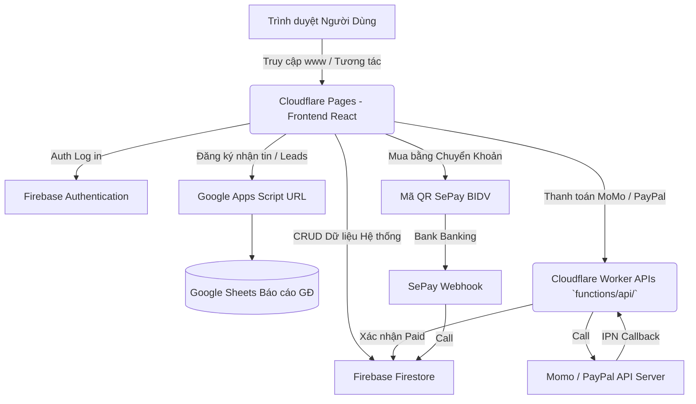

# 🗺️ BẢN ĐỒ KIẾN TRÚC HỆ THỐNG (MVP ARCHITECTURE MAP)
*Tài liệu Chuẩn hóa Dành cho Lập trình viên, Kỹ sư Bảo trì và Vận hành Hệ thống.*

Dự án: **Edu-Vibe / CoachAI Coaching Platform**
Domain Live: `edu.victorchuyen.net`

Tài liệu này cung cấp bức tranh toàn cảnh về cách hệ thống được thiết lập, chạy mã nguồn gì, lưu trữ dữ liệu ở đâu và cách các Middleware, 3rd-party Services liên kết với nhau. Bất kỳ lập trình viên Frontend, Backend hay DevOps nào khi onboard dự án đều cần đọc file này đầu tiên.

---

## 🏗 Tổng Quan Công Nghệ (Tech Stack)

### 1. Frontend (Giao diện người dùng)
Hệ thống sử dụng tư duy "Single Page Application (SPA)" tốc độ cao.
- **Framework Chính:** `React 18` kết hợp `Vite` (Build tool siêu tốc).
- **Ngôn ngữ:** `TypeScript` (Strict typing).
- **Styling:** `TailwindCSS` (Utility-first CSS) + `Lucide-React` (Icons).
- **Animations:** `Framer Motion` (Motion/React).
- **Routing:** `React Router DOM` (V6).
- **Đa ngôn ngữ (i18n):** `react-i18next` (Tiếng Anh, Tiếng Việt).
- **Cấu trúc Thư mục:** Đặt toàn bộ trong thư mục `src/`.
  - `src/components/`: Chứa các mảnh UI tái sử dụng (Navbar, Footer, CourseCard).
  - `src/pages/`: Chứa các màn hình chính (Home, Courses, CourseDetails, Payment) và thư mục `dashboard/` phân quyền theo Role.

### 2. Hệ Sinh Thái Backend & Database
Dự án được triển khai theo kiến trúc Serverless (Không máy chủ truyền thống), sử dụng mạnh mẽ hệ sinh thái của Google.
- **Database Gốc (Main Data):** `Firebase Firestore` (NoSQL).
  - *Nhiệm vụ:* Lưu trữ User Profile, cấu hình Khóa Học (Courses), Phân quyền Role (Admin/Teacher/Student), Trạng thái Thanh Toán, và Quản lý Payout.
- **Authentication (Xác thực):** `Firebase Authentication`.
  - *Nhiệm vụ:* Đăng ký/Đăng nhập qua Email+Password và Google Login (`firebase.google.com`).
- **File Storage:** (Firebase Storage hoặc Cloudinary được setup khi up ảnh nền/bài giảng).
- **Cloud Functions:** `Firebase Cloud Functions` (Node.js/TypeScript) nằm trong thư mục `firebase-backend/`. Dùng cho các tác vụ cần bảo mật backend.
- **Bảo mật Database:** Quy định ở file `firestore.rules`.

### 3. Hosting & Deployment (Triển khai Server)
- **Quản lý Mã Nguồn:** `GitHub` (Repository: `chuyentn/coachai`).
- **Nền tảng Deploy Frontend & API:** `Cloudflare Pages`.
  - Toàn bộ source Frontend được GitHub Actions / Cloudflare tích hợp tự động Build (`npm run build`).
  - Hệ thống sử dụng file `public/_redirects` với rule `/* /index.html 200` để bắt luồng SPA Router.
  - Các Cloudflare Functions (`functions/api/...`) đóng vai trò Serverless proxy nhận request cổng thanh toán, sau đó xác thực và giao tiếp ngược vào Database Firebase.

### 4. Hệ Thống Thanh Toán Tiền Tệ (Payment Gateways)
1. **SePay (Chuyển khoản Ngân Hàng - BIDV/Vietcombank/MB):** 
   - Webhook của SePay được cấu hình gọi về Firebase Network hoặc Cloudflare Worker để nhận callback (Data API) thông báo tiền vào tài khoản thật, sau đó cập nhật status Firestore `role: VIP` hoặc mở khóa Course tự động.
2. **MoMo (E-Wallet):**
   - API Sandbox/Live Momo cấu hình qua thư mục Cloudflare Functions. HMAC SHA256 Signature sinh ra trực tiếp bằng Web Crypto trên Workers để bảo mật Secret Key.
3. **PayPal (Quốc tế):**
   - API chuẩn REST thông qua Smart Payment Buttons ở giao diện và Cloudflare Functions `create`/`capture` API backend.

### 5. Xử lý Data Rời (Webhooks / Automations)
- **Nguồn Data Leads thu thập email / Comments người dùng / Review đánh giá:**
  - Không chỉ dùng Firebase, một số luồng Data quan trọng phục vụ vận hành Marketing được chuyển và back-up Real-time ra **Google Sheets**.
  - **Công cụ:** Gửi request Post thông qua Webhook URL của `Google Apps Script` (Mã nguồn `.gs` có tham khảo trong project).

---

## 📚 Kiến Trúc Lưu Trữ Khóa Học & Tài Liệu (Course Storage Blueprint)

**Tình trạng hiện tại (Legacy):** Trang chủ và trang `/courses/mock-1` đang chạy bằng JSON tĩnh (Mock Data) đóng ghim sẵn trong code. Điều này gây khó trong scale nội dung lớn và không tự động hóa được.
**Định hướng V2 (Real-time Database + CRM):**

### 1. Nguồn Dữ Liệu Khóa Học (Course Content)
Toàn bộ Cấu trúc (Tên Khóa, Giá Bán, Mô Tả) phải được migrate thành Documents trong Firebase Firestore collection mang tên `courses`.
- **Media (Videos & Images):** 
  - Ảnh Thumbnail tải lên thông qua Firebase Storage lấy URl Public gán vào Firestore.
  - Video khóa học được khuyên nghị Host trên Server chuyên biệt như **Vimeo**, **YouTube Unlisted** hoặc CDN để tối ưu băng thông (tránh quá tải Firestore/Cloudflare).
- **Tài liệu đính kèm (PDF/Zip):** Upload qua Firebase Storage dưới quyền `auth.uid` xác thực, đảm bảo chỉ có User trả tiền (VIP) mới có quyền đọc và download bảo vệ bản quyền.

### 2. Mô Hình Nâng Cao: Đồng bộ Data Firebase & Google Sheets (GAS CRM)
Để đội ngũ Leader, Marketing không cần biết Code vẫn quản lý được leads và dữ liệu, ta dùng giải pháp kết hợp **Google Apps Script (GAS)** và Firebase Automations:

*   **Firebase Cloud Functions Trigger:** Mỗi khi có 1 Lead vào (`onDocumentCreated` trong bảng "users") hoặc 1 User Nhập Feedback ("comments"/"reviews"), Firebase sẽ tự động bắn POST Request (Fetch API).
*   **Google Apps Script (Webhook Receiver):** 
    - Phía Google Sheets, vào `Extensions -> Apps Script`.
    - Viết hàm `doPost(e)` để nhận gói tin HTTP POST Payload (JSON chứa tên, SĐT, comment từ Firebase).
    - Code GAS nâng cao sẽ tự động phân loại: Nếu là Lead đỗ vào Sheet `[Leads Mới]`, Nếu là Comment đổ vào `[Feedback Sinh Viên]`. Định dạng Timestamp chuẩn.
    - Cuối cùng GAS trả lại HTTP 200 OK cho dòng Code bên Web an tâm.

> **💡 Tại sao làm thế này?** 
> Dữ liệu được đảm bảo Dual-bound. Web chạy siêu tốc vì kéo từ Firebase. Nhưng Marketing và Sales Team vẫn có một bản Google Sheet Realtime để gọi điện chốt khách, lọc báo cáo doanh thu tài chính mà không sợ vô tình xóa Data Core của Server.

---

## 🔌 Sơ Đồ Kết Nối (Connection Map)

---

## 👥 Ma Trận Vai Trò Người Dùng (Role Matrix)

Hệ thống được thiết kế phục vụ 3 tập người dùng cốt lõi, mỗi role có scope quyền hạn và Dashboard tách biệt hoàn toàn để đảm bảo bảo mật.

### 1. Học Viên (Student)
- **Luồng vào:** Truy cập qua Form Đăng Ký (`/auth/signup`) -> Vào thẳng `/dashboard/student`.
- **Tính năng được phép:** 
  - Xem và học các khóa Public (Miễn phí) và Khóa VIP (nếu đã mua).
  - Sử dụng AI Coach Helper (Trợ lý ảo học tập) tích hợp trên trang chi tiết bài học.
  - Lấy Link Affiliate cá nhân để đi giới thiệu nhận hoa hồng.
- **Mối quan hệ:** Học viên là người tạo ra Doanh thu (Payments), là Lead chuyển đổi, và nằm dưới sự quản lý của Admin. Đóng vai trò là Ref-er (Người giới thiệu) trong Affiliate System.

### 2. Giảng Viên / Chuyên Gia (Teacher)
- **Luồng vào:** Nâng cấp từ Student (Qua sự phê duyệt của Admin) -> Đăng nhập vào `/dashboard/teacher`.
- **Tính năng được phép:**
  - Course Builder: Tạo nháp khóa học mới, tải lên Video bài giảng, cấu hình giá bán. Bấm "Publish" sẽ chuyển sang trạng thái chờ Admin duyệt (Pending).
  - Quản lý học viên của riêng mình.
  - Xem Báo cáo Doanh thu cá nhân (Doanh thu = Tổng bán - N% hoa hồng của sàn).
  - Lên lệnh Rút tiền (Payout) về ngân hàng.
- **Mối quan hệ:** Là Content Creator. Bán chất xám để nhận chia sẻ doanh thu (Revenue Share) từ hệ thống. Không thể can thiệp khóa học của Teacher khác.

### 3. Quản Trị Viên (Admin)
- **Luồng vào:** Setup cứng từ Database Firestore (Set field `role: "admin"`) -> Vào `/dashboard/admin`.
- **Tính năng (Quyền Cao Nhất):**
  - Xem toàn cảnh: Doanh thu tổng sàn, Tổng user, Tỷ lệ nạp VIP.
  - Kiểm duyệt (Approval): Phê duyệt hoặc Từ chối khóa học mà Teacher đẩy lên.
  - User Control: Khóa tài khoản, nâng cấp VIP thủ công, phong tước Teacher.
  - Tài chính (Finance): Phê duyệt và chuyển khoản thủ công cho các lệnh Rút tiền của Teacher (Payout Management).
- **Mối quan hệ:** Nắm quyền sinh sát (Root Auth). Các Route `/admin` được bảo vệ nghiêm ngặt (Route Protection Alias) và đá các tài khoản Teacher/Student ra ngoài nếu cố tình truy cập.

---

## 💵 Hệ Thống Kinh Doanh (Business Models)

### Hệ Thống Affiliate (Tiếp thị liên kết)
- **Nguyên lý:** Mỗi Student tự động có một mã UID riêng (gắn vào params `?ref=uid`). 
- **Tracking:** Khi User B chia sẻ link, User C truy cập link đó và click Đăng Ký -> System sẽ lưu `referred_by` = UID của B vào Firestore. Từ đó phát sinh hoa hồng.

### Hệ Thống Payments (Đồng bộ Thanh toán)
- Trang Đăng Ký VIP (`/payment`): Hoạt động như cổng Check-out.
- Bất chấp User Thanh toán qua Ví Điện Tử (MoMo) hay mã QR Chuyển khoản (SePay), Workflow cuối cùng là Background API sẽ đánh dấu `status: paid` và kích hoạt ngay lập tức quyền lợi VIP (Unlocks courses) trên UI ở real-time.

---

## 🛠 Hướng Dẫn Local Development & Deploy
1. **Chạy Local (Cài đặt môi trường):**
   - Lệnh cài đặt: `npm install`
   - Khởi động Development: `npm run dev`. File `server.ts` đóng vai trò là một Vite Proxy Server tích hợp cho môi trường Dev.
2. **Cấu hình Biến Môi Trường (Environment Variables):**
   - Đảm bảo thiết lập đầy đủ config file `.env` tham khảo từ `.env.example` chứa các khóa Firebase, Cổng Thanh Toán và CRM Webhook URL.
3. **Môi Trường Live Deploy (Cloudflare CI/CD):**
   - Mã nguồn được bảo vệ trên Git. Bất cứ khi code được Merged vào nhánh `main` bằng lệnh `git push origin main`.
   - Cloudflare tự động trigger -> chạy test `npm run lint` -> build ra thư mục `dist` -> Gắn lên Domain chính qua hạ tầng mạng Cloudflare CDN toàn cầu.

---
*Tài liệu này được soạn thảo ở Phase 12 (V2 Project) để đồng bộ mọi nhánh cho tương lai.*
