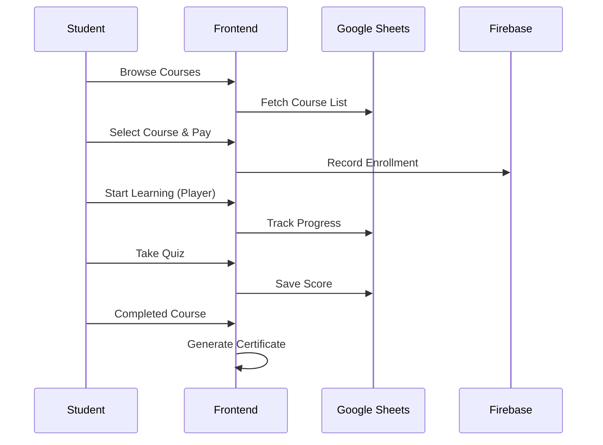

# User Flows

Detailed journeys for the three primary user roles in the platform.

## 1. Student Journey: Enrollment to Certification

---

## 2. Teacher Journey: Course Onboarding
1.  **Registration**: Teacher signs up and selects "Register as Teacher".
2.  **Application**: Fills in bio, expertise, and proposed courses (Stored in `Teachers` sheet).
3.  **Approval**: Admin reviews and switches role to `teacher` in Firestore.
4.  **Submission**: Teacher creates a new course in the Dashboard (Sends `action: course` to Apps Script).
5.  **Publishing**: Admin approves the course; it becomes visible to students.

---

## 3. Admin Journey: Platform Management
-   **Multi-tenant Setup**: 
    1. Admin adds a new row to `tenants` sheet.
    2. Website immediately responds to the new domain with custom branding.
-   **User Control**: 
    1. Admin navigates to `/dashboard/admin`.
    2. Fetches user list from Firestore.
    3. Changes roles or locks accounts directly in the UI.
-   **Financials**: 
    1. Views withdrawal requests submitted by affiliates.
    2. Approves payment and updates status in Sheets/Firestore.
